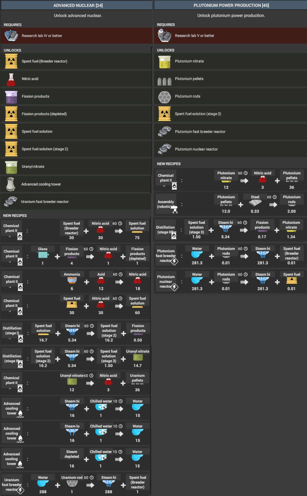
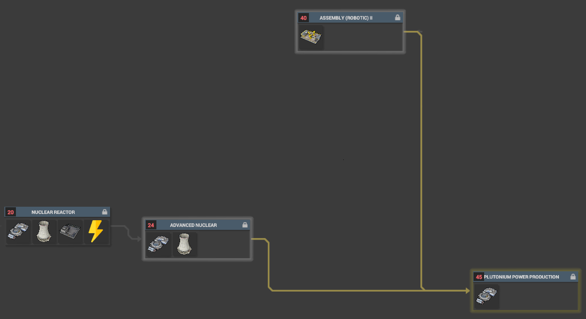

# NuclearPlus

Provides advanced nuclear research to the game.

> :warning: **Currently ***alpha***. Buildings and recipes may change...**

Currently provides:
* Fast breeder reactor (Uranium & Plutonium)
* Plutonium reactor
* Advanced cooling tower
* Many new products (uranyl nitrate, plutonium nitrate, nitric acid, ...)

More may come... please create an issue for any suggestions or bugs.

# How to install

> :warning: **You will need to start a new game to play this mod. This is a restriction of CoI.**

Download the latest release: https://github.com/NotoriousPyro/NuclearPlus/releases

1. From the downloaded zip, copy the contents of the `Mods` folder to your Captain of Industry `Mods` folder.

    By default, this is `Documents\Captain of Industry\Mods`. You can find out where exactly by running the following in PowerShell:
    ```powershell
    ((new-object -COM Shell.Application).Namespace(0x05).Self.Path + '\Captain of Industry\Mods')
    ```

2. Verify inside 'Mods' folder, each sub-folder has **a dll file with the same name as the folder**, it is fine if other DLLs are also present.

3. Enable the `Enable mods` options in the ingame settings.

4. Start a new game!

# How to use

## Uranium breeder reactor & fuel recycling
> :warning: **Void producers from CoI.Mod.Better are used as inputs in this example**

In order to extend this to support plutonium rods, simply take the output of the stage 2 distiller to a stage 3 distiller and set up another Chemical Plant II to create the rods.


## Research
Research is via:
* **Advanced nuclear**: dependant on Nuclear reactor first being completed.
* **Plutonium power production**: dependant on Robotic III and Advanced nuclear first being completed.



